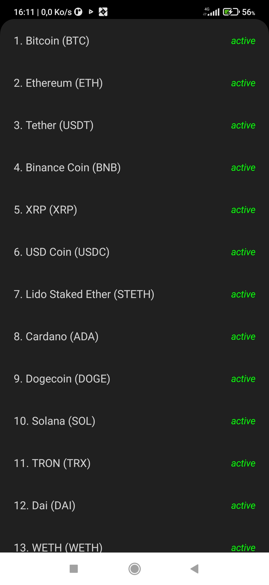
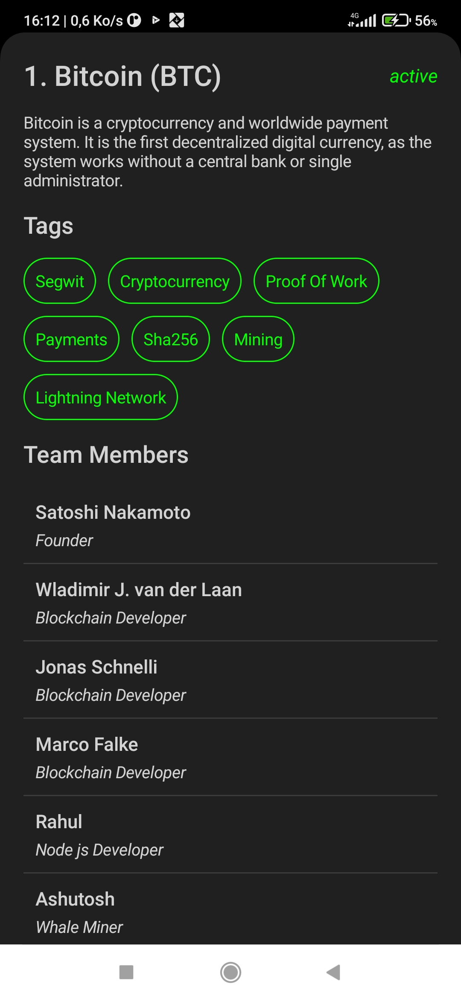

# Cryptocurrency App

A mobile application that provides information about various cryptocurrencies.

## Description

The Cryptocurrency App is a mobile application built to display information about different cryptocurrencies. It includes two main screens: one for listing all available cryptocurrencies and another for displaying detailed information about a specific cryptocurrency.

## Screenshots

## Features

- View a list of all available cryptocurrencies.
- Access detailed information about a specific cryptocurrency.
- Data is fetched from a remote server using the CoinPaprika API.
- Utilizes Dagger Hilt for dependency injection.
- Built with Jetpack Compose for a modern and efficient UI.

